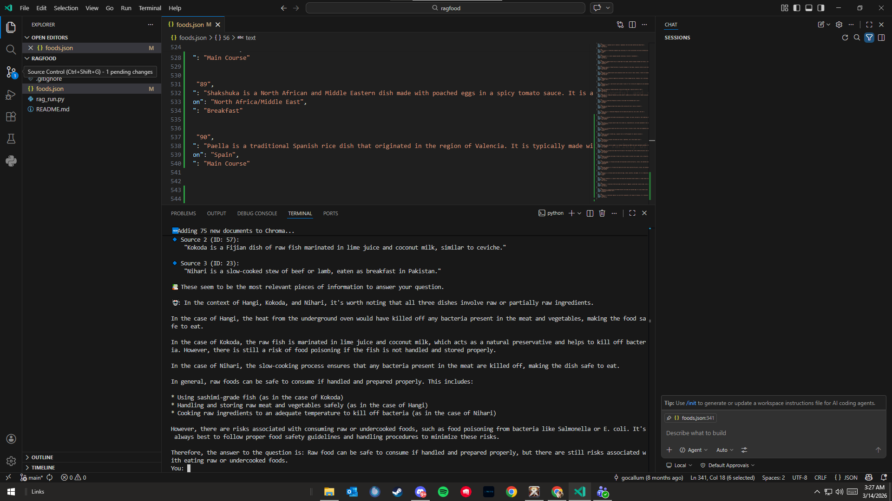
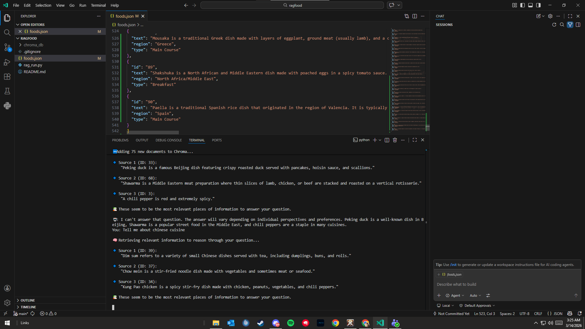

Here’s a clear, beginner-friendly `README.md` for your RAG project, designed to explain what it does, how it works, and how someone can run it from scratch.

---

## 📄 `README.md`

````markdown
# 🧠 RAG-Food: Simple Retrieval-Augmented Generation with ChromaDB + Ollama

This is a **minimal working RAG (Retrieval-Augmented Generation)** demo using:

- ✅ Local LLM via [Ollama](https://ollama.com/)
- ✅ Local embeddings via `mxbai-embed-large`
- ✅ [ChromaDB](https://www.trychroma.com/) as the vector database
- ✅ A simple food dataset in JSON (Indian foods, fruits, etc.)
- ✅ added 15 new foods from Philippines, Italy, India, Greece, Middle East, etc.

---

## 🎯 What This Does

This app allows you to ask questions like:

- “Which Indian dish uses chickpeas?”
- “What dessert is made from milk and soaked in syrup?”
- “What is masala dosa made of?”

It **does not rely on the LLM’s built-in memory**. Instead, it:

1. **Embeds your custom text data** (about food) using `mxbai-embed-large`
2. Stores those embeddings in **ChromaDB**
3. For any question, it:
   - Embeds your question
   - Finds relevant context via similarity search
   - Passes that context + question to a local LLM (`llama3.2`)
4. Returns a natural-language answer grounded in your data.

Sample queries and expected responses from your data:




Personal Reflection on RAG learning experience:

Building this RAG-Food system was a real eye-opener into how modern AI actually works. It taught me that an AI is only as smart as the information you give it. By connecting a private database of food items to the Llama 3.2 model, I saw firsthand how "Retrieval-Augmented Generation" turns a general AI into a specialized expert that can answer specific questions about my own data.

Adding 15 unique dishes—from local Filipino favorites to healthy international meals—was the most rewarding part. It wasn't just about typing names; it was about teaching the system to understand ingredients, nutrition, and cultural history through vector embeddings. This process showed me that the "magic" of AI is actually a structured pipeline: the system searches my data, finds the most relevant facts, and then uses the language model to explain them naturally.

Using Git and GitHub to fork and manage this project also helped me practice the professional workflow used by developers. This project shifted my perspective from just "using" AI to actually "building" and customizing it. I now feel much more confident in my ability to take a technical repository, modify it with my own ideas, and turn it into a functional tool that solves specific problems.
---

## 📦 Requirements

### ✅ Software

- Python 3.8+
- Ollama installed and running locally
- ChromaDB installed

### ✅ Ollama Models Needed

Run these in your terminal to install them:

```bash
ollama pull llama3.2
ollama pull mxbai-embed-large
````

> Make sure `ollama` is running in the background. You can test it with:
>
> ```bash
> ollama run llama3.2
> ```

---

## 🛠️ Installation & Setup

### 1. Clone or download this repo

```bash
git clone https://github.com/RahimAbrigonda/ragfood
cd rag-food
```

### 2. Install Python dependencies

```bash
pip install chromadb requests
```

### 3. Run the RAG app

```bash
python rag_run.py
```

If it's the first time, it will:

* Create `foods.json` if missing
* Generate embeddings for all food items
* Load them into ChromaDB
* Run a few example questions

---

## 📁 File Structure

```
rag-food/
├── rag_run.py       # Main app script
├── foods.json       # Food knowledge base (created if missing)
├── README.md        # This file
```

---

## 🧠 How It Works (Step-by-Step)

1. **Data** is loaded from `foods.json`
2. Each entry is embedded using Ollama's `mxbai-embed-large`
3. Embeddings are stored in ChromaDB
4. When you ask a question:

   * The question is embedded
   * The top 1–2 most relevant chunks are retrieved
   * The context + question is passed to `llama3.2`
   * The model answers using that info only

---

## 🔍 Try Custom Questions

You can update `rag_run.py` to include your own questions like:

```python
print(rag_query("What is tandoori chicken?"))
print(rag_query("Which foods are spicy and vegetarian?"))
```

---

## 🚀 Next Ideas

* Swap in larger datasets (Wikipedia articles, recipes, PDFs)
* Add a web UI with Gradio or Flask
* Cache embeddings to avoid reprocessing on every run

---

## 👨‍🍳 Credits

Made by Collum using:

* [Ollama](https://ollama.com)
* [ChromaDB](https://www.trychroma.com)
* [mxbai-embed-large](https://ollama.com/library/mxbai-embed-large)
* Indian food inspiration 🍛
